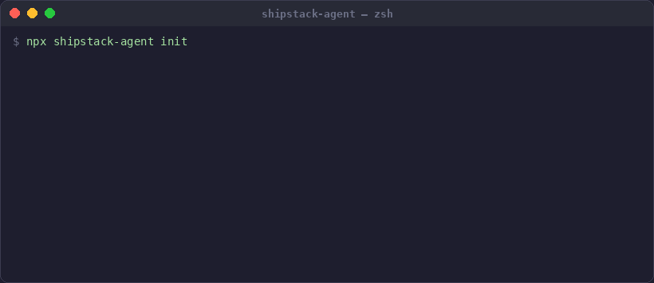

<p align="center">
  
  
  
  
</p>

<h1 align="center">ShipStack Agent</h1>

<p align="center">
  <strong>Your fullstack monorepo, generated in 2 minutes. Always fresh. AI-ready from day one.</strong><br/>
  One command to scaffold a production-grade app — auth, payments, email, storage, AI — with zero stale dependencies.
</p>

<p align="center">
  <code>npx shipstack-agent init</code>
</p>

<p align="center"></p>

---

## The Problem

Every fullstack project starts the same way: 2 days wiring up auth, payments, email, file uploads, database schemas, and project structure. Then another day fighting dependency mismatches because the template you cloned was last updated 6 months ago.

You haven't written a single line of business logic yet.

## The Fix

ShipStack Agent is not a template. It's a CLI that **generates your project from scratch** in ~2 minutes:

1. **Pick what you need** — frontend (Expo or Vite+React), services (payments, email, storage, AI, cron, webhooks)
2. **Get walked through setup** — the CLI opens each service's dashboard in your browser and collects API keys
3. **Get a production-ready codebase** — runs real scaffold commands, installs latest packages, writes typed code
4. **Start building immediately** — auth, database, and your selected services are wired and ready

Every `npm install` pulls the latest published versions. No template to go stale. No boilerplate repo to maintain.

## Quick Start

### Option A: CLI

```bash
npx shipstack-agent init
```

The CLI walks you through everything interactively — project name, frontend, services, API key collection, and generation.

### Option B: Claude Code

Open this repo in [Claude Code](https://docs.anthropic.com/en/docs/claude-code) and say:

> Follow the GUIDE.md to set up a new project for me

Claude reads the guide and builds your project conversationally — same output, more interactive.

## What You Get

A **Turborepo monorepo** with only what you selected — nothing more:

```
my-app/
├── apps/
│   ├── api/              → Fastify v5 + Better Auth + Drizzle ORM
│   └── mobile/ or web/   → Expo (React Native) or Vite + React + TailwindCSS
├── packages/
│   ├── db/               → Drizzle schema + PostgreSQL config
│   └── shared/           → Zod validation schemas + shared constants
├── CLAUDE.md             → AI-ready docs (Claude Code understands your project)
├── docs/PATTERNS.md      → Step-by-step recipes for common tasks
├── docs/llms/            → Provider docs (better-auth.txt, stripe.txt, etc.)
└── .env                  → API keys (collected during setup)
```

## Services

Auth and database are always included. Everything else is opt-in:

| Pick | You get |
|------|---------|
| **Auth** | Better Auth with email/password, Google, GitHub, Magic Link, 2FA |
| **Database** | Drizzle ORM + PostgreSQL (Neon, Railway, Docker, or your own URL) |
| **Payments** | Stripe checkout + subscription webhooks (web) or RevenueCat (mobile) |
| **Email** | Resend integration with email service helper |
| **Storage** | S3 or Cloudflare R2 with presigned upload/download routes |
| **AI** | OpenAI (GPT-4o) or Fal.ai with completion endpoint |
| **Cron Jobs** | node-cron scheduler with registration pattern |
| **Webhooks** | Outbound webhook dispatch with HMAC signatures |
| **Rate Limiting** | @fastify/rate-limit (100 req/min default) |

## Why Not a Template?

| | Templates | ShipStack Agent |
|---|---|---|
| **Dependencies** | Stale within weeks | Always latest (`@latest` on every install) |
| **Unused code** | Full template, delete what you don't need | Only generates what you selected |
| **API keys** | Figure it out yourself | Opens dashboards, guides you step by step |
| **AI-ready** | No | Generates CLAUDE.md + PATTERNS.md + provider llms.txt |
| **Maintenance burden** | Template repo needs constant updates | CLI generates from scratch — nothing to maintain |

## Built for AI-Assisted Development

Every generated project includes documentation that AI coding tools understand out of the box:

- **`CLAUDE.md`** — Project structure, conventions, active services, and development rules tailored to your exact configuration
- **`docs/PATTERNS.md`** — Step-by-step recipes for adding models, routes, validation schemas, and service-specific patterns
- **`docs/llms/*.txt`** — Actual provider documentation (fetched from better-auth.com, stripe.com, resend.com, etc.)

This means Claude Code, Cursor, or any LLM-powered tool can understand your project's architecture, conventions, and available services from the first prompt.

## Why These Choices

Every dependency in the generated stack is a deliberate bet:

- **Fastify over Express** — 2-3x faster, built-in schema validation, first-class TypeScript. Express is legacy; Fastify is where the ecosystem is moving.
- **Drizzle over Prisma** — SQL-like syntax, zero runtime overhead, no binary engine to deploy. Your queries read like SQL, not magic methods.
- **Better Auth over NextAuth/Lucia** — framework-agnostic, plugin-based, works identically on Fastify and any frontend. No vendor lock to Next.js.
- **Turborepo over Nx** — zero config for npm workspaces, fast caching, stays out of your way. You don't need a PhD to run `npm run dev`.
- **Zod everywhere** — one schema definition shared between frontend forms and API validation. Change it once, both sides update.

## The Stack

| Layer | Technology |
|-------|-----------|
| Monorepo | Turborepo + npm workspaces |
| API | Fastify v5 |
| Auth | Better Auth |
| Database | Drizzle ORM + PostgreSQL |
| Validation | Zod (shared between frontend and API) |
| Frontend (web) | Vite + React + TailwindCSS |
| Frontend (mobile) | Expo (React Native) |

## Regenerate Docs

As your project evolves, regenerate the AI documentation:

```bash
npx shipstack-agent docs
```

Reads `.shipstack.json` from your project root and refreshes CLAUDE.md, PATTERNS.md, and provider llms.txt files.

## Community

- Found a bug or want a new service? [Open an issue](https://github.com/mgorabbani/shipfast-agent-ready-stack/issues)
- Want to add a service or improve generation? PRs are welcome — see the contributing guide below

## Contributing

```bash
git clone https://github.com/mgorabbani/shipfast-agent-ready-stack.git
cd shipfast-agent-ready-stack && npm install

# Run the CLI locally
cd packages/cli && npx tsx src/index.ts init

# Build
cd packages/cli && npm run build
```

See [CLAUDE.md](./CLAUDE.md) for repo conventions and step-by-step instructions on adding new services.

## License

[MIT](./LICENSE)
